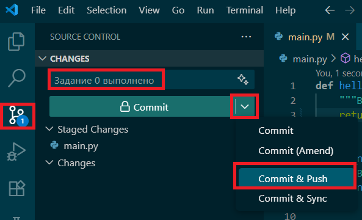
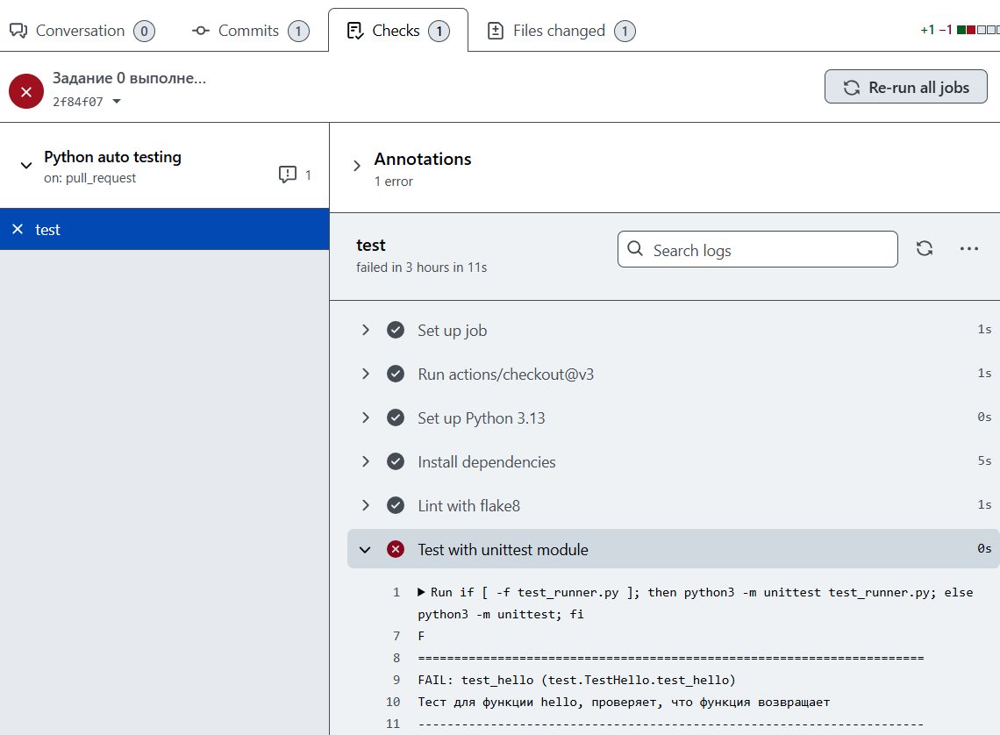

# Задания по программированию
Задания предполагают реализацию на языке Python 3.13. Для выполнения заданий рекомендуется использовать IDE Visual Studio Code.

Задания размещены в отдельных ветках репозитория, название которых начинается с префикса main, например, ветка main-task-0.

В файле README.md в ветке задания расположена информация, необходимая для его выполнения.

# Выполнение заданий
**Для выполнения конкретного задания необходимо создать отдельную ветку** на основе ветки с заданием, назвать новую ветку в соответствии с веткой задания, заменив префикс main на название команды, например first-team-task-0.

Предварительно необходимо получить с сервера ветку с заданием, для этого можно использовать команду `git fetch origin` или воспользоваться вкладкой Source Control на боковой панели IDE


На основе ветки с заданием нужно создать ветку для решения


Как правило, для выполнения задания необходимо реализовать предложенные функции в файле main.py. В файлах с префиксом test расположены модульные тесты для проверки правильности реализации функций. Если необходимо реализовать несколько функций, например fibonacci и determinant, то в ветке будут соответствующие файлы с модульными тестами test_fibonacci.py и test_determinant.py, а также файл test_runner.py, объединяющий тесты из отдельных файлов. Провести тестирование можно путем запуска на выполнение файлов с модульными тестами или файла test_runner.py. 

Рекомендуется настроить тесты на вкладке Testing левой панели


Нажать кнопку Configure Python Tests после чего выбрать фреймворк unittest


Корневую директорию проекта 


Шаблон имени файла для поиска тестов *test*.py


Затем необходимо перезагрузить IDE.


После чего тесты будут доступны для просмотра и запуска в боковой панели


После выполнения задания и прохождения тестов можно с помощью команд в терминале:
- Запустить автоматическую сортировку импортов в исходном коде `python -m isort .`
- Запустить автоматическое форматирование исходного кода `python -m black .`
- Запустить проверку синтаксиса и форматирования `python -m flake8 . --max-complexity=10 --max-line-length=88 --exclude .venv`.

## Результат выполнения задания - pull request
После реализации предложенных функций, прохождения всех модульных тестов, проверки синтаксиса и оформления кода, необходимо зафиксировать изменения (git commit) и отправить их в репозиторий на Github (git push). Это можно сделать на вкладке Source Control, добавив через + нужный файл и написав сообщение коммита




При первом коммите Git может попросить заполнить данные пользователя в конфигурации


Можно задать имя и почту глобально с помощью команд:

```sh
git config --global user.email "you@example.com"
git config --global user.name "Your Name"
```


или локально, только для текущего репозитория, убрав из команд опцию --global. Эти данные используются для метаданных коммитов.

Если текущей ветки нет на сервере GitHub будет выведено соответствующее предупреждение, с которым нужно согласиться.


После фиксации и отправки изменений необходимо создать на Github запрос слияния с главной веткой задания (pull request). Важно не ошибиться с выбором веток для запроса, в base необходимо указать главную ветку, например main-task-0, а в compare указать собственную ветку с выполненным заданием, например first-team-task-0. В заголовке запроса можно указать название своей ветки, для удобного просмотра списка запросов на слияние. В описании запроса можно указать роли участников команды, выполнявших задание или добавить какую-то информацию если это явно указано в задании.


После создания запроса на слияние производится автоматический запуск тестов, ход выполнения и результаты можно посмотреть на вкладке Checks. 




Если выполнение тестов выявило ошибки, следует исправить их, снова зафиксировать и отправить изменения на Github, изменения автоматически отражаются в запросе на слияние (**повторный запрос на слияние создавать не нужно**). На вкладке Files changed видны изменения в файлах, по сравнению с целевой веткой. На вкладке Conversation ведется обсуждение выполненного задания. Если автоматическое тестирование не выявило ошибок, владелец репозитория проведет ревью кода и подтвердит его либо оставит вопросы или замечания. После подтверждения выполненное задание будет оценено и запрос на слияние будет закрыт.