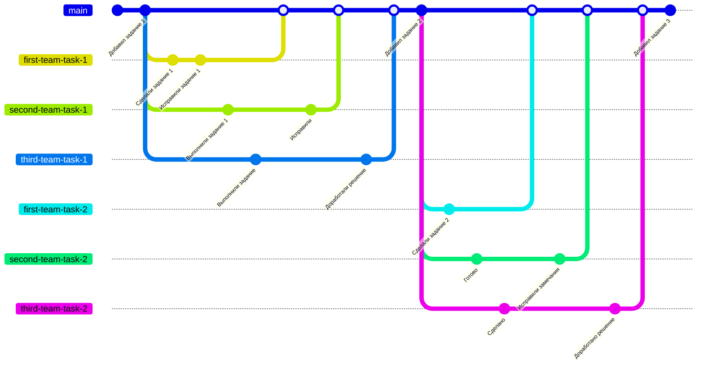
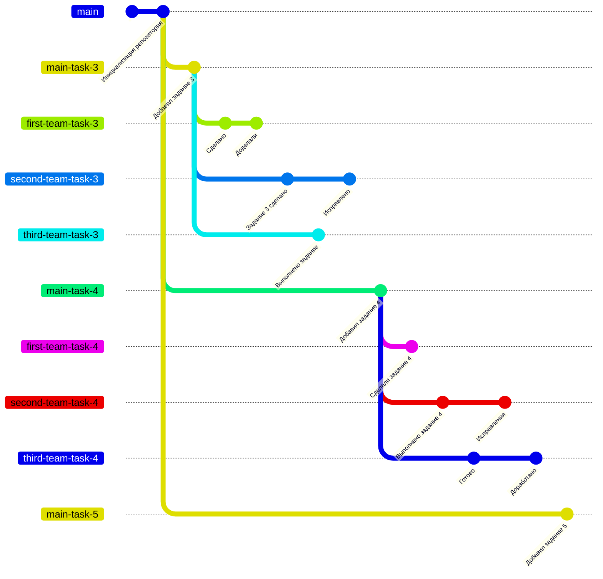
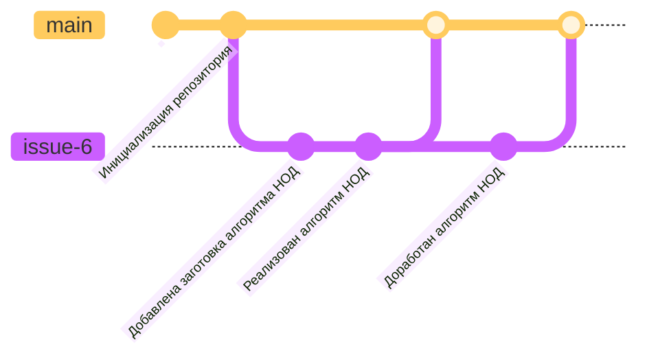

---
Структура ветвления репозитория с ручными заданиями
--- 

Задания размещаются в основной ветке с названием main. Для выполнения задания команда студентов создает отдельную ветку на основе ветки main. В отдельной ветке, например first-team-task-1 студенты добавляют решение задания и создают запрос на внесение изменений с решением в ветку main. Преподаватель проверяет открытые запросы на внесение изменений, при наличии замечаний оставляет комментарии к запросу, а при отсутствии замечаний одобряет запрос и вливает предложенные изменения в основную ветку. В результате все задания и все решения будут находится в основной ветке main.

---
Структура ветвления репозитория с программными заданиями
--- 

В основной ветке репозитория с названием main размещена общая информация о выполнении заданий по программированию. Сами задания размещаются в отдельных ветках с префиксом main в названии, например main-task-3. **Ветки с префиксом main являются защищенными** и студенты не могут вносить изменения непосредственно в этих ветках. Для выполнения задания команда студентов создает отдельную ветку на основе ветки с решаемым заданием, например main-task-3. В этой ветке, например first-team-task-3 студенты добавляют решение задания и создают запрос на внесение изменений с решением в ветку **с решаемым заданием**. При открытии запроса на внесение изменений выполняются автотесты, проверяющие программный код, написанный студентами. Информация о прохождении тестов автоматически добавляется к запросу. Преподаватель проверяет открытые запросы на внесение изменений, при наличии замечаний оставляет комментарии к запросу, а при отсутствии замечаний принимает выполненное задание и закрывает запрос без вливания предложенных изменений в ветку. В результате все задания и решения расположены в отдельных ветках.

---
Структура ветвления репозитория с web-приложением
--- 

В репозитории с исходным кодом web-приложения имеется основная защищенная ветка с названием main, на основе которой автоматически обновляется сервер с web-приложением. Заготовка для задания создается в ветке, основанной на ветке main, в этой ветке студенты выполняют задание и создают запрос на внесение изменений в ветку main. При создании запроса выполняются автоматические проверки, после чего изменения проверяются преподавателем и при отсутствии замечаний вливаются в ветку main. После обновления ветки обновляется сервер web-приложения, на котором можно проверить доработки.

