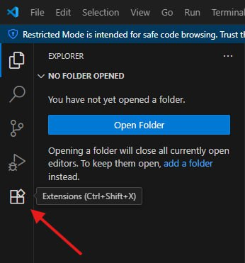
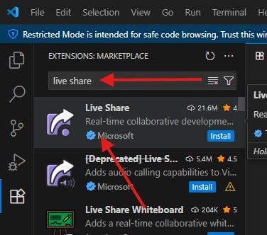
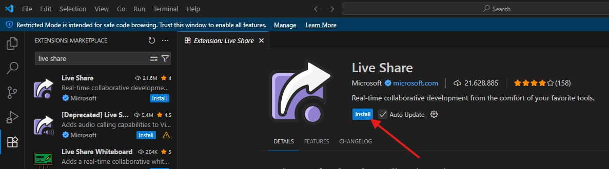
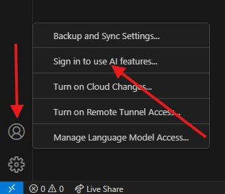

# 🛠 Инструкция: Как установить и настроить расширение Live Share в Visual Studio Code для совместной работы

Расширение Live Share от Microsoft позволяет вам совместно работать над кодом в реальном времени с другими разработчиками — прямо в вашем редакторе. Ниже приведены шаги по его установке.

## **Установка Live Share**

### 🔹 Шаг 1: Откройте панель расширений
Нажмите на иконку расширений (квадратик с четырьмя квадратиками) в левой боковой панели VS Code.

> 💡 Или нажмите сочетание клавиш:  
> Ctrl+Shift+X (Windows/Linux) или Cmd+Shift+X (macOS)

---

### 🔹 Шаг 2: Найдите расширение Live Share
В поле поиска введите:  
`Live Share`

> ⚠️ Убедитесь, что вы выбрали официальное расширение от Microsoft — оно имеет значок с фиолетовым кругом и белой стрелкой, а также помечено как Microsoft.

---

### 🔹 Шаг 3: Установите расширение
Нажмите кнопку Install рядом с расширением Live Share от Microsoft.

> ✅ После установки кнопка изменится на “Manage” или “Disable/Uninstall”.

---

### 🔹 Шаг 4 (опционально): Включите автообновление
После установки рекомендуется включить Auto Update, чтобы всегда получать последние обновления и исправления безопасности. Это можно сделать, поставив галочку рядом с опцией Auto Update (рядом с кнопкой Install).

> 📌 Важно: Если вы видите расширение [Deprecated] Live Share — не устанавливайте его. Оно больше не поддерживается. Устанавливайте только официальное расширение от Microsoft.

---

# **Совместная работа**

### 🔐 Шаг 1: Авторизация (если требуется)

При первом запуске Live Share может запросить авторизацию через ваш аккаунт — это нужно для безопасного обмена данными и управления доступом.

#### Как авторизоваться:
1. Нажмите кнопку на которой изображен человечек в левом нижнем углу экрана.
   

2. Выберите подходящий способ авторизации в появившемся окне.
   

3. Следуйте инструкциям в браузере и вернитесь в VS Code.

> ✅ После успешной авторизации вы увидите своё имя/логин по нажатии на кнопку с человечком.

---

### 🌐 Шаг 2: Запуск сессии совместной работы

Теперь вы готовы начать сессию!

#### Вариант A: Запустить свою сессию

1. Нажмите иконку **Live Share** в левой панели.
2. В открывшемся окне **LIVE SHARE: SESSION DETAILS** нажмите:
   - **Share (Read/Write)** — чтобы дать участникам полный доступ к редактированию.
   - **Share (Read-Only)** — если хотите, чтобы участники только просматривали код.

> 💡 После нажатия кнопки будет сгенерирована ссылка, которую можно отправить другим участникам.

#### ⚠️Чтобы ссылку на текущую сессию нажмите на соответствующую кнопку

---

#### Вариант B: Присоединиться к чужой сессии
Если вам прислали ссылку на сессию:
1. Нажмите **Join** в том же окне.
2. Вставьте ссылку и нажмите Enter.
3. Подтвердите подключение — и вы попадёте в сессию.

> ✅ Готово! Теперь вы можете работать в одной среде.
> 

#### ⚠️Чтобы завершить текущую сессию нажмите на соответствующую кнопку

---

# Дополнительная информация

### 👥 Управление сессией

После запуска сессии интерфейс Live Share меняется — теперь вы видите:

- **Participants (0)** — список участников. Нажмите, чтобы пригласить других.
- **Shared Terminals (0)** — возможность запустить общий терминал.
- **Shared Servers (0)** — если вы запускаете сервер (например, `npm start`), он станет доступен всем.
- **Comments (0)** — обсуждения прямо в коде.
- **Session chat** — чат внутри сессии.

> 📌 Вы можете раскрыть эти пункты, кликнув по стрелочкам слева — как показано на изображении.

---

### 🧩 Полезные функции во время сессии

✅ **Общий курсор** — вы видите, где работает другой участник.  
✅ **Совместная отладка** — можно запускать и отлаживать код вместе.  
✅ **Общий терминал** — все могут выполнять команды в одном терминале.  
✅ **Чат и комментарии** — обсуждайте код без переключения в мессенджеры.  
✅ **Разделённое окно** — удобно, если вы работаете над разными файлами.

---

### ❗ Важные моменты

- Все изменения в файле сохраняются **локально** — Live Share не изменяет исходный код на стороне участника, пока он не сохранит его сам.
- Чтобы завершить сессию — нажмите **“End Session”** (иконка “X” в правом верхнем углу панели Live Share).
- Можно ограничить доступ: использовать **Read-Only** режим или **приглашать только определённых пользователей**.

---

### 🎯 Советы для эффективной работы

🔹 **Используйте Read-Only**, если вы просто показываете код.  
🔹 **Запускайте общий терминал**, если нужно тестировать приложение вместе.  
🔹 **Говорите в чате**, если работаете в разных часовых поясах.  
🔹 **Не забывайте закрывать сессию** после работы — особенно если работаете с конфиденциальным кодом.

Удачи в совместной работе! 👨‍💻👩‍💻

