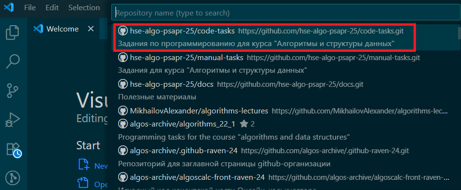

# Для прохождения курса рекомендуется настроить:

## GitHub account
Создать учетную запись на сервисе GitHub и отправить ее преподавателю для добавления в GitHub-организацию для выполнения заданий курса.

## Git
Установить Git, если он еще не установлен. Установщик для Windows можно скачать с официального сайта https://git-scm.com/downloads/win

## Python 3.13
Установить Python в версии 3.13, если он еще не установлен. Если установлен Python в другой версии, установите дополнительно 3.13. Установщик для Windows можно скачать с [официального сайта](https://www.python.org/ftp/python/3.13.7/python-3.13.7-amd64.exe)

**Важно!** При установке необходимо добавить путь до Python в переменные окружения.

## VS Code
**Установить IDE Visual Studio Code**, если она еще не установлена. Установщик для Windows можно скачать с официального сайта https://code.visualstudio.com/Download

**Установить расширения** для VS Code, рекомендуемый набор:
- Python https://marketplace.visualstudio.com/items?itemName=ms-python.python
- Pylance https://marketplace.visualstudio.com/items?itemName=ms-python.vscode-pylance
- Python Debugger https://marketplace.visualstudio.com/items?itemName=ms-python.debugpy
- GitLens https://marketplace.visualstudio.com/items?itemName=eamodio.gitlens
- Code Spell Checker https://marketplace.visualstudio.com/items?itemName=streetsidesoftware.code-spell-checker
- Russian - Code Spell Checker https://marketplace.visualstudio.com/items?itemName=streetsidesoftware.code-spell-checker-russian
- Markdown Preview Github Styling https://marketplace.visualstudio.com/items?itemName=bierner.markdown-preview-github-styles

Не забудьте включить расширение проверки орфографии для русского языка

**Клонировать репозиторий** с заданиями, предварительно авторизовавшись на GitHub 

После авторизации репозитории организации будут доступны для выбора и клонирования

**Настроить виртуальное окружение для Python** в созданном проекте. Это важный пункт, так вы изолируете репозиторий с заданиями курса от других своих проектов на Python и избежите конфликтов различных версий библиотек.

Для создания среды нужно запустить в VS Code терминал, на Windows можно запустить Command Prompt

Выполнить в терминале команды (для Windows):
- `py -3.13 -m venv .venv` для создания каталога venv с виртуальным окружением проекта
- `.venv\Scripts\activate.bat` - для активации окружения

В командной строке должен появится префикс `(.venv)`, указывающий на то, что вы находитесь в виртуальном окружении. Это означает, что все команды, связанные с Python и pip, будут выполняться в контексте этого окружения.

После создания виртуальной среды IDE предложит использовать ее по умолчанию, нужно подтвердить.

Вручную задать интерпретатор виртуальной среды можно через выбор команды F1 -> Select Interpreter

Проверьте, если в редакторе открыт файл Python, то в правом нижнем углу редактора должен быть выбран интерпретатор Python из виртуального окружения:

Далее необходимо установить зависимости проекта (необходимые библиотеки), указанные в файле requirements.txt, это можно сделать с помощью команды в терминале `pip install -r requirements.txt`
